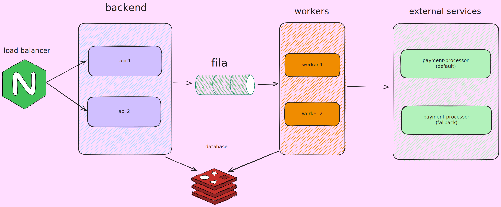

# Rinha de Backend 2025 - Edição 3

Esta é uma implementação para o desafio da [Rinha de Backend 2025](https://github.com/zanfranceschi/rinha-de-backend-2025), focada em performance e consistência no processamento de pagamentos.

## Arquitetura e Funcionamento

A aplicação foi desenhada para ser uma API de pagamentos assíncrona, capaz de receber um alto volume de requisições, processá-las em background e fornecer um sumário com o total de pagamentos processados.


O fluxo da aplicação:

1.  **Recebimento:** A API recebe uma requisição `POST /payments` com um `correlationId` e um `amount`.
2.  **Enfileiramento:** A requisição é imediatamente adicionada a uma fila no Redis (utilizando `LPUSH`) como uma tarefa de background. A API retorna um status `202 Accepted`, liberando o cliente rapidamente.
3.  **Processamento Assíncrono:** Um pool de *workers* (consumidores) monitora a fila do Redis constantemente. Cada *worker* pega uma tarefa da fila e a processa.
4.  **Comunicação Externa:** O *worker* envia os dados do pagamento para um processador de pagamentos externo (configurado via `PAYMENT_PROCESSOR_URL`).
5.  **Armazenamento:** Se o processador externo confirmar o pagamento, o resultado é armazenado em um *Sorted Set* no Redis, usando o timestamp como *score* para permitir consultas por data.
6.  **Sumarização:** A API expõe um endpoint `GET /payments-summary` que permite consultar os pagamentos processados, com a possibilidade de filtrar por um intervalo de datas (`from_` e `to`). A sumarização é feita com um script Lua executado diretamente no Redis para máxima eficiência.

## Tecnologias Utilizadas

*   **Linguagem:** Python 3.13+
*   **Framework API:** [FastAPI](https://fastapi.tiangolo.com/)
*   **Banco de Dados & Fila:** [Redis](https://redis.io/)
*   **Cliente HTTP:** [HTTPX](https://www.python-httpx.org/) para chamadas assíncronas ao processador de pagamentos.
*   **Serialização de Dados:** [orjson](https://github.com/ijl/orjson) para parsing JSON de alta performance.
*   **Gerenciador de Pacotes:** [uv](https://github.com/astral-sh/uv)

## Como Executar o Projeto

### Pré-requisitos

*   Python 3.13 ou superior
*   Um servidor Redis em execução.
*   `uv` instalado (`pip install uv`).

### 1. Clone o Repositório

```bash
git clone https://github.com/Alan-Gomes1/rinha-backend-2025.git
cd rinha-backend-2025
```

### 2. Instale as Dependências

Use o `uv` para criar um ambiente virtual e instalar as dependências listadas no `pyproject.toml`.

```bash
uv pip sync
```

### 3. Configure as Variáveis de Ambiente

Copie o arquivo de exemplo `.env-example` para um novo arquivo chamado `.env` e preencha as variáveis.

```bash
cp .env-example .env
```

**Variáveis de ambiente (`.env`):**

| Variável                  | Descrição                                                              | Exemplo                           |
| ------------------------- | ---------------------------------------------------------------------- | --------------------------------- |
| `REDIS_HOST`              | Host do servidor Redis.                                                | `localhost`                       |
| `REDIS_PORT`              | Porta do servidor Redis.                                               | `6379`                            |
| `REDIS_DB`                | Número do banco de dados Redis a ser usado.                            | `0`                               |
| `REDIS_QUEUE`             | Nome da fila principal de pagamentos no Redis.                         | `payments`                        |
| `MAX_WORKERS`             | Número máximo de workers para processar pagamentos em paralelo.        | `10`                              |
| `PAYMENT_PROCESSOR_URL`   | URL do serviço externo que processa os pagamentos.                     | `http://localhost:8001/payments`   |
| `PAYMENT_PROCESSOR_TIMEOUT` | Timeout em segundos para a chamada ao processador externo.             | `10`                              |

### 4. Execute a Aplicação

O comando a seguir iniciará o servidor FastAPI e os workers de background que consomem a fila do Redis.

```bash
python app/main.py
```

A API estará disponível em `http://127.0.0.1:8000`.

## Endpoints da API

### Adicionar um Pagamento

*   **URL:** `/payments`
*   **Método:** `POST`
*   **Status de Sucesso:** `202 Accepted`
*   **Corpo da Requisição (JSON):**

    ```json
    {
      "correlationId": "abc-123-def-456",
      "amount": 150.75
    }
    ```

### Sumário de Pagamentos

*   **URL:** `/payments-summary`
*   **Método:** `GET`
*   **Status de Sucesso:** `200 OK`
*   **Parâmetros de Query (Opcionais):**
    *   `from_`: Data de início no formato ISO (e.g., `2025-08-15T10:00:00`).
    *   `to`: Data de fim no formato ISO (e.g., `2025-08-16T23:59:59`).
*   **Resposta (JSON):**

    ```json
    {
      "total_amount": 5430.20,
      "total_count": 123
    }
    ```
